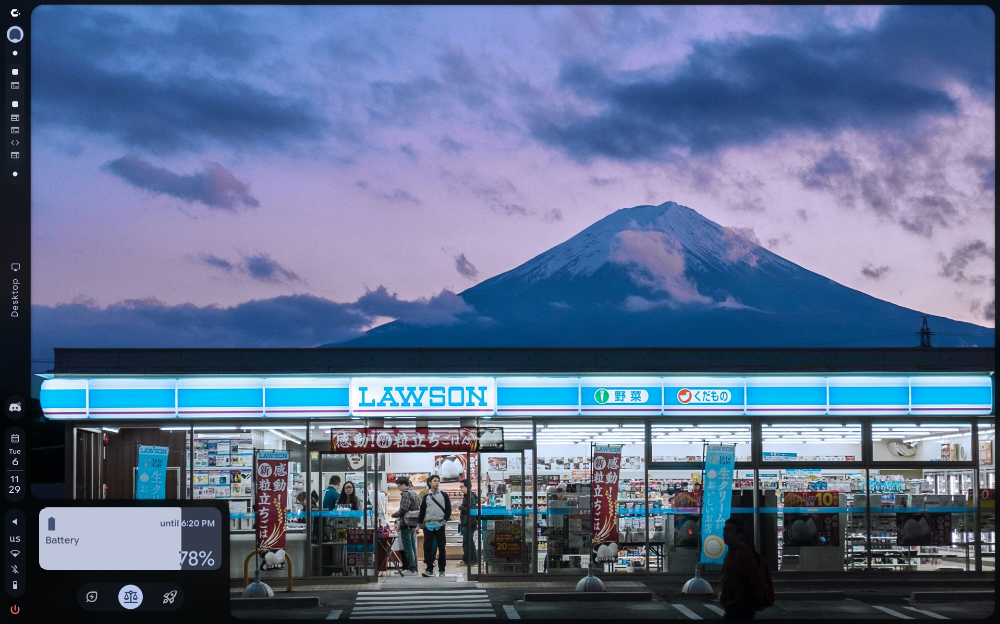
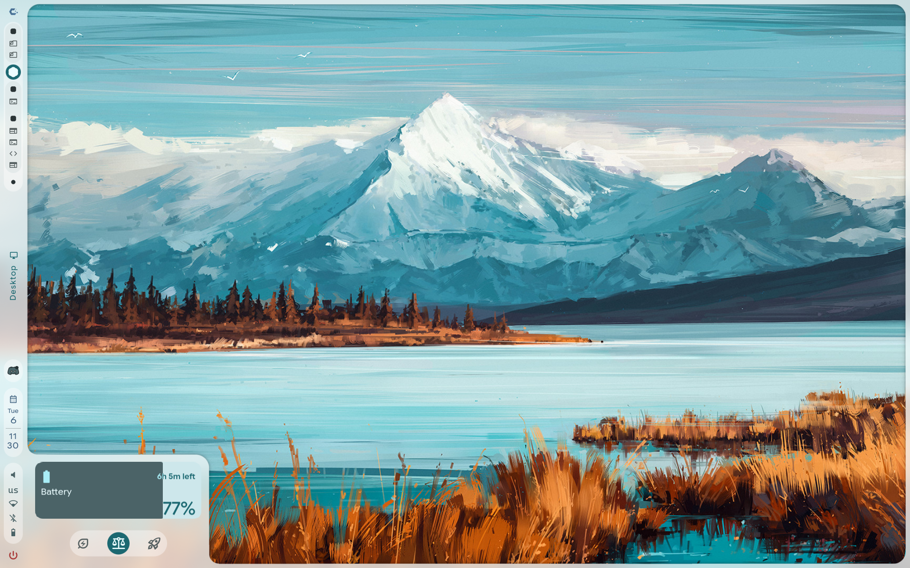

# Caelestia Battery Popout

A restyled battery popout for the [Caelestia](https://github.com/caelestia-dots/shell) shell:

- A wide fill gauge that shows the charge, with the text changing colour as the fill passes under it
- The time left shown inside the gauge, like `6h 29m left`, or `28m to full` while charging
- Turns green and pulses while charging

## Screenshots



## Install

```bash
git clone https://github.com/ItsXyzzy/caelestia-material-battery.git
cd caelestia-material-battery
./install.sh
```

It asks how to show the time: **time left** (`6h 29m left`) or **time until** (`until 22:30`), and for "until", 12-hour, 24-hour or whatever your shell uses. Skip the questions with options:

```bash
./install.sh --time-style until --clock 24
```

Run it again any time to change them. Then restart the shell. Don't use sudo. It installs into `~/.config/quickshell/caelestia`, copying the system config there first if you don't have one, so package updates won't undo it.

## Uninstall

```bash
./uninstall.sh
```

## Good to know

- It replaces the stock `Battery.qml`. The original is saved as `Battery.qml.bak`. If you've customised it, back it up first.
- The charging green is fixed, not taken from your colour scheme.
- Tested on Caelestia v2.5.0
- Only tested on CachyOS with Hyprland.

## Manual install

Copy `qml/modules/bar/popouts/Battery.qml` to `~/.config/quickshell/caelestia/modules/bar/popouts/`. Optional: at the top of the file, set `useClockTime` to `true` for "until 22:30", and `clockFormat` to `"12"` or `"24"`.

## License

GPL-3.0
